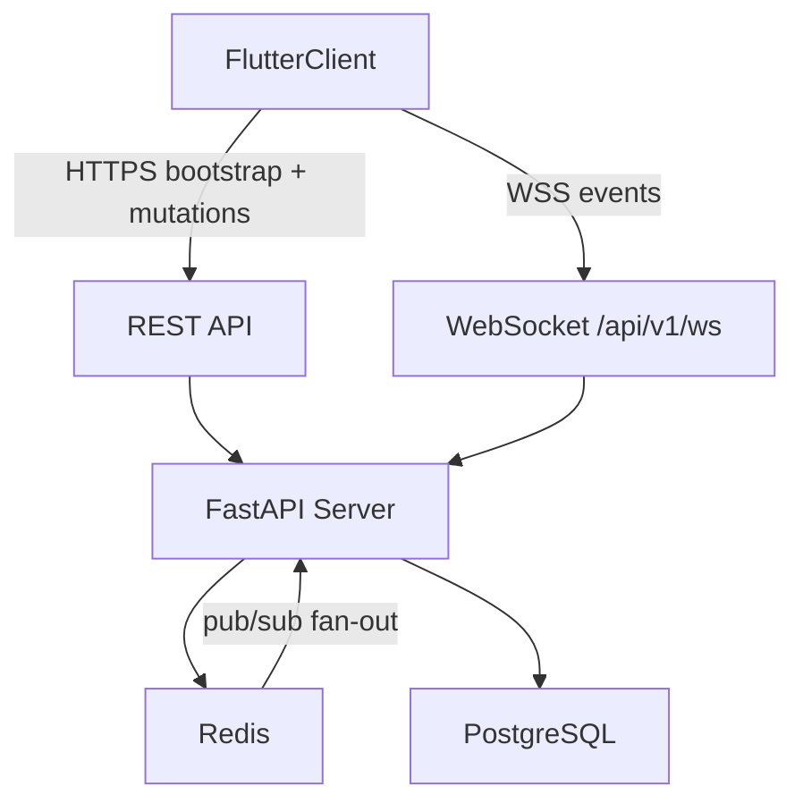

# InGame -- Real-Time Coordination Design Spec

> Part of the [InGame Product Roadmap](roadmap.md)

## Overview

This spec covers **Sub-Project 2: Real-Time Coordination**. It builds on the Core Platform foundation from [2026-05-30-core-platform-design.md](2026-05-30-core-platform-design.md) and defines the realtime architecture required for live presence, readiness signaling, lightweight group activity, and session scheduling.

The goal of SP2 is to make coordination feel immediate: a user can mark themselves as ready, other group members see that status update live, and the app can grow into session proposals and RSVP flows on top of the same transport and event model.

---

## Scope

### In Scope
- authenticated WebSocket connection lifecycle
- live presence and status broadcasting (`online`, `ready`, `away`, `offline`)
- initial presence bootstrap when a client connects
- Redis-backed pub/sub fan-out across multiple backend replicas
- group activity events for status changes and session lifecycle
- session scheduling data model and CRUD contract
- Flutter realtime providers and presence UI integration
- backend and frontend test coverage for realtime behavior

### Out of Scope
- push notifications (SP4)
- game matching and Steam library sync (SP3)
- public lobbies and open matchmaking (SP5)

---

## Architecture



### Core Principles
- REST remains the source for bootstrap and durable writes.
- WebSocket is used for live fan-out and fast UI updates.
- Redis pub/sub is mandatory for cross-instance fan-out in staging/prod.
- PostgreSQL stores durable session/activity records; Redis stores ephemeral presence.
- Flutter first hydrates from REST, then applies live updates from WebSocket.

---

## Transport Contract

### WebSocket Endpoint
- **Path:** `/api/v1/ws`
- **Auth:** JWT access token passed as `?token=<access_token>` for the current phase
- **Reconnect:** client must re-read the latest access token before reconnecting
- **Server behavior:** reject missing/invalid token with close code and reason

### Event Envelope
All server-to-client events use one envelope shape:

```json
{
  "type": "status_changed",
  "timestamp": "2026-05-30T20:15:00Z",
  "group_id": "uuid-if-group-scoped",
  "payload": {}
}
```

### Naming Rules
- client-to-server commands use imperative names, e.g. `status_change`, `session_propose`, `session_rsvp`
- server-to-client events use past-tense names, e.g. `status_changed`, `session_proposed`, `session_rsvp_updated`
- group-scoped fan-out events include `group_id`

---

## Presence Model

### User Status Values
- `online`
- `ready`
- `away`
- `offline`

### Redis Structures
- `user:{id}:status` -- hash: `{state, game, since}`
- `group:{id}:online` -- set of currently connected user IDs
- `group:{id}:events` -- pub/sub channel for fan-out

### Bootstrap Strategy
When a client connects:
1. authenticate user
2. load the user’s group memberships from PostgreSQL
3. mark the user present in Redis group sets
4. send an initial `presence_snapshot` event to the connecting client for all relevant groups
5. broadcast `user_online` to other connected members

The snapshot payload contains, per group:
- online member IDs
- each known user status (`state`, `game`, `since`) from Redis

### Multi-Replica Rule
- all broadcast-worthy events must be published to Redis
- each app replica must run a subscriber loop that consumes `group:{id}:events`
- in-process broadcast may still be used for local delivery, but Redis publication is the source of cross-instance propagation

---

## Session Scheduling

### Durable PostgreSQL Model

**Session**
| Column | Type | Notes |
|--------|------|-------|
| id | UUID | Primary key |
| group_id | UUID | FK -> Group |
| proposed_by | UUID | FK -> User |
| title | VARCHAR | Optional short label |
| game | VARCHAR | Optional game name |
| starts_at | TIMESTAMP | Proposed session time |
| notes | TEXT | Optional |
| status | VARCHAR | `proposed`, `confirmed`, `cancelled` |
| created_at | TIMESTAMP | Auto-set |
| updated_at | TIMESTAMP | Auto-updated |

**SessionRsvp**
| Column | Type | Notes |
|--------|------|-------|
| id | UUID | Primary key |
| session_id | UUID | FK -> Session |
| user_id | UUID | FK -> User |
| response | VARCHAR | `in`, `out`, `maybe` |
| updated_at | TIMESTAMP | Auto-updated |
| Unique constraint | | `(session_id, user_id)` |

### REST Contract
- `GET /api/v1/groups/{group_id}/presence`
- `GET /api/v1/groups/{group_id}/sessions`
- `POST /api/v1/groups/{group_id}/sessions`
- `PATCH /api/v1/groups/{group_id}/sessions/{session_id}`
- `POST /api/v1/groups/{group_id}/sessions/{session_id}/rsvp`

### WebSocket Commands
- `status_change`
- `session_propose`
- `session_update`
- `session_rsvp`

### WebSocket Events
- `presence_snapshot`
- `user_online`
- `user_offline`
- `status_changed`
- `session_proposed`
- `session_updated`
- `session_rsvp_updated`

---

## Flutter Architecture

### Providers
- `websocketConnectionProvider` owns authenticated socket lifecycle
- `presenceProvider` stores per-group online/status state derived from snapshot + events
- `groupSessionsProvider(groupId)` stores session lists and RSVP state
- REST bootstrap providers remain responsible for initial group/member/session fetches

### UI Integration
- `StatusIndicator` remains the canonical readiness signal
- group member rows use a single live-status composition built from `UserAvatar` + `StatusIndicator`
- group detail screens show:
  - who is online
  - who is ready
  - active/proposed sessions
  - recent activity events where applicable

### Configuration
- REST and WebSocket base URLs must be environment-configurable
- local dev may default to localhost
- deployed builds must support `https` + `wss`

---

## Backend Responsibilities

### REST
- validate durable writes
- return bootstrap snapshots for sessions and group context
- expose presence bootstrap endpoint for current group state

### WebSocket
- authenticate and attach user to group scopes
- accept client commands
- persist ephemeral status updates to Redis
- persist durable session mutations to PostgreSQL
- publish fan-out events to Redis channels
- broadcast locally to sockets connected on the same replica

---

## Testing Strategy

### Backend
- WebSocket auth tests: missing, invalid, valid token
- WebSocket lifecycle tests: connect, disconnect, reconnect
- Redis-backed fan-out tests: event published once and delivered across subscriber path
- presence snapshot tests: joining client receives expected bootstrap payload
- session REST tests: create/update/list/RSVP
- multi-user integration tests: one user changes status, another receives update

### Flutter
- `WebSocketClient` tests: connect, decode, disconnect, reconnect with fresh token
- provider tests: auth transition triggers connect/disconnect, event stream updates presence state
- widget tests: member list/status rendering from live provider state
- integration tests: login -> open group -> receive live status change

### CI Requirements
- `flutter analyze`
- `flutter test`
- backend test suite
- spec freshness check
- API/spec validation
- realtime tests must run in CI before SP2 work is considered complete

---

## Deployment Notes

- staging/prod run multiple replicas and therefore require Redis subscriber fan-out
- health checks should evolve to include realtime dependencies where feasible
- production WebSocket traffic must use `wss://`

---

## Change Log

| Date | Section | Change | Reason |
|------|---------|--------|--------|
| 2026-05-30 | Initial spec | Created SP2 Real-Time Coordination spec with WS endpoint, event model, Redis/pubsub rules, session data model, Flutter architecture, and test strategy | Pre-SP2 stabilization requires a written realtime contract before transport and fan-out fixes |
