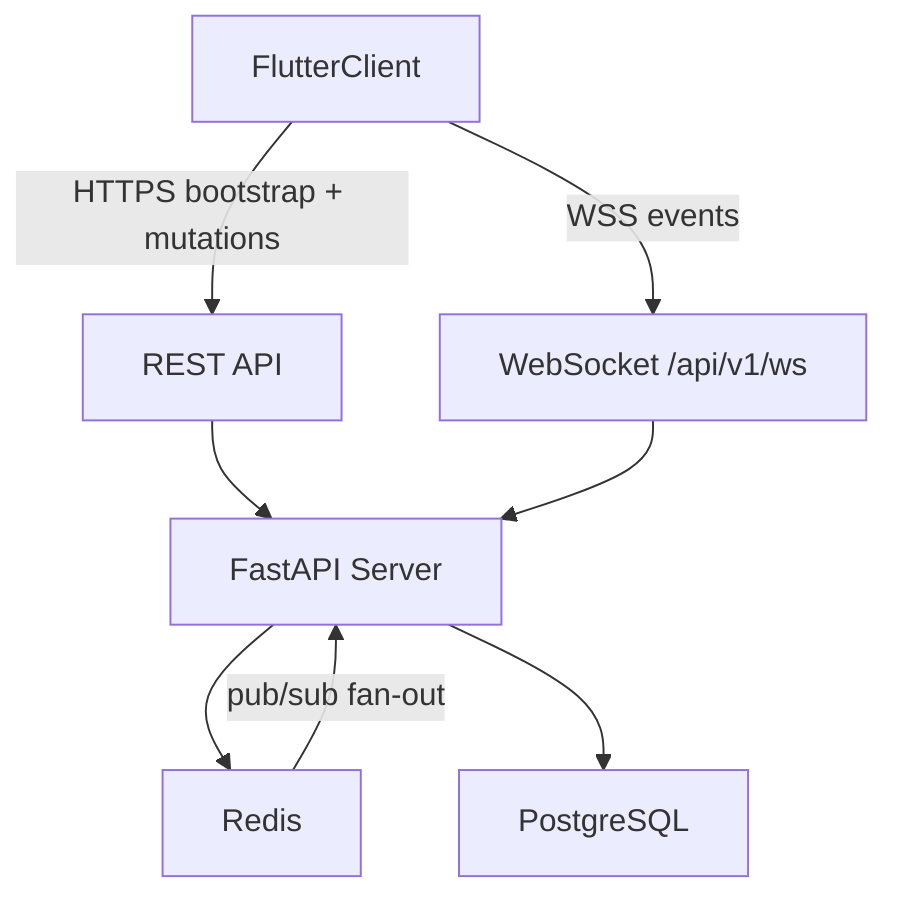

# InGame -- Real-Time Coordination Overview Spec

> Part of the [InGame Product Roadmap](roadmap.md)

## Overview

This spec covers **Sub-Project 2: Real-Time Coordination**. It builds on the Core Platform foundation from [2026-05-30-core-platform-design.md](2026-05-30-core-platform-design.md) and defines the realtime architecture required for:

- live presence
- readiness signaling
- scheduled readiness
- lightweight group activity
- session scheduling

The goal of SP2 is to make coordination feel immediate: a user can mark themselves as ready, other group members see that update live, and the app can coordinate both scheduled personal availability publication and explicit session proposals on top of the same transport and event model.

This file is now the SP2 entry point. Detailed contracts live in focused child specs linked below.

---

## Delivered Scope

SP2 now delivers the full coordination slice on top of the earlier presence-first transport foundation:

- authenticated WebSocket connection lifecycle
- derived connection presence (`online`, `away`, `offline`)
- group-scoped ready state with 8-hour fallback expiry
- scheduled ready windows with CRUD over REST and live server-event fan-out
- group calendar and coordination hub surfaces in Flutter
- session proposals with RSVP (`in`, `maybe`, `out`)
- lightweight group activity stream for scheduled-ready and session lifecycle updates
- backend and frontend test coverage for presence plus coordination fan-out

### Presence Rules

- only **`ready`** is user-controlled
- **`online`**, **`offline`**, and **`away`** are derived states
- **`online` / `offline`** come from authenticated WebSocket connection lifecycle
- **`away`** is driven by app background/inactive lifecycle and returns to **`online`** on resume while the socket stays connected
- **`ready`** is group-scoped, not global
- **`ready`** persists until the user turns it off, with an automatic **8-hour fallback expiry**
- presence renders app-wide wherever group members are shown, not only on group detail

### Presence Display Priority

When rendering a member's single status badge:

1. `ready` if the user is ready in that group and the ready expiry has not passed
2. `offline` if the user has no active WebSocket connection
3. `away` if connected but the client reported background/inactive
4. `online` otherwise

Ready remains visible even when the user backgrounds the app or disconnects. Connection-derived presence remains secondary context and must not clear or re-broadcast ready by itself while the ready window is still active.

---

## Scope

### In Scope

- initial presence bootstrap when a client connects
- Redis-backed pub/sub fan-out across multiple backend replicas
- Flutter realtime providers for presence plus coordination models
- REST bootstrap and mutation endpoints for scheduled-ready windows, sessions, RSVPs, and activity
- Flutter planning hub navigation and group coordination surfaces
- backend and frontend test coverage for realtime behavior beyond the presence-only kickoff

### Follow-On Enhancements

- recurring-availability overlay/filter that consumes SP1 `preferred_gaming_hours` data without redefining it inside SP2
- richer calendar filters or alternate time-range views beyond the shipped planning hub
- reminders or countdown affordances that sit on top of SP2 session data without changing the core data model

### Out of Scope

- push notifications (SP3)
- game matching and Steam library sync (SP4)
- public lobbies and open matchmaking (SP5)

SP2 deliberately separates:

- **Recurring profile availability (SP1)** -- durable, profile-owned weekly preferences such as "usually evenings on weekdays"
- **Scheduled ready windows (SP2)** -- near-term, user-published "I expect to be ready at these times" slots that can be shown live in a group calendar
- **Session proposals (SP2)** -- explicit group play plans with RSVP and optional game context

---

## Spec Set

SP2 is now split into one overview plus focused realtime specs:

- [Transport & Presence](2026-05-30-real-time-coordination-transport-presence.md) -- WebSocket transport, event envelope, presence model, Redis structures, bootstrap, commands, and fan-out rules
- [Coordination Models](2026-05-30-real-time-coordination-coordination-models.md) -- scheduled ready windows, calendar rules, session scheduling, activity feed, and the shipped REST/WebSocket contracts
- [Implementation](2026-05-30-real-time-coordination-implementation.md) -- Flutter architecture, backend responsibilities, completion gates, testing expectations, and deployment notes

Use this overview for SP2 boundaries and current delivery scope. Use the child specs for precise contracts.

---

## Architecture

### Core Principles

- REST remains the source for bootstrap and durable writes
- WebSocket is used for live fan-out and fast UI updates only after durable coordination mutations commit successfully
- Redis pub/sub is mandatory for cross-instance fan-out in staging and production
- PostgreSQL stores durable session/activity records while Redis stores ephemeral presence
- Flutter hydrates presence from WebSocket snapshots, coordination models from REST, then applies live updates incrementally without blanking the planning hub during routine coordination mutations

---

## Change Log

| Date | Section | Change | Reason |
|------|---------|--------|--------|
| 2026-06-04 | Spec topology | Converted the larger SP2 realtime spec into a thin overview plus focused transport/presence, coordination-models, and implementation child specs | Keeps phase-1 delivery contracts readable while letting future SP2 planning evolve without bloating one document |
| 2026-06-05 | Delivery status | Marked SP2 complete and updated the overview to reflect the shipped scheduled-ready, session, RSVP, activity, and coordination-hub slice | Keeps the SP2 entry point aligned with the delivered coordination contract before Notifications becomes the next numbered sub-project |
| 2026-06-05 | Durability and coordination UX follow-through | Clarified commit-before-fan-out websocket semantics and the incremental planning-hub update model after the audit follow-up | Keeps the maintained SP2 overview aligned with the corrected backend durability contract and the shipped non-disruptive coordination UX |
