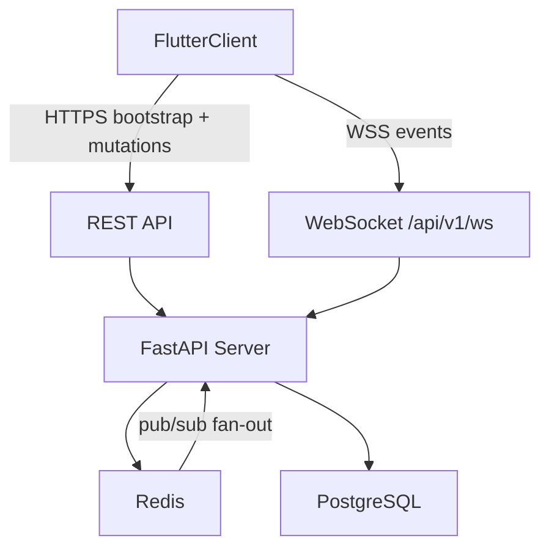

# InGame -- Real-Time Coordination Design Spec

> Part of the [InGame Product Roadmap](roadmap.md)

## Overview

This spec covers **Sub-Project 2: Real-Time Coordination**. It builds on the Core Platform foundation from [2026-05-30-core-platform-design.md](2026-05-30-core-platform-design.md) and defines the realtime architecture required for live presence, readiness signaling, lightweight group activity, and session scheduling.

The goal of SP2 is to make coordination feel immediate: a user can mark themselves as ready, other group members see that status update live, and the app can grow into session proposals and RSVP flows on top of the same transport and event model.

---

## Phase 1 Scope (Presence-First Kickoff)

Phase 1 delivers **presence only**. Session scheduling, activity feed, and related REST endpoints remain planned but out of the first implementation slice.

### Product Rules
- Only **`ready`** is user-controlled.
- **`online`**, **`offline`**, and **`away`** are **derived** states.
- **`online` / `offline`** come from authenticated WebSocket connection lifecycle.
- **`away`** is driven by app **background/inactive** lifecycle and returns to **`online`** on resume while the socket stays connected.
- **`ready`** is **group-scoped**, not global.
- **`ready`** persists until the user turns it off, with an automatic **8-hour fallback expiry** if they forget.
- Presence renders **app-wide wherever group members are shown**, not only on group detail.

### Display Priority
When rendering a member's single status badge:
1. `offline` if the user has no active WebSocket connection
2. `away` if connected but the client reported background/inactive
3. `ready` if the user is ready in that group and the ready expiry has not passed
4. `online` otherwise

---

## Scope

### In Scope (Phase 1)
- authenticated WebSocket connection lifecycle
- derived connection presence (`online`, `away`, `offline`)
- group-scoped ready state with 8-hour fallback expiry
- initial presence bootstrap when a client connects
- Redis-backed pub/sub fan-out across multiple backend replicas
- Flutter realtime providers and presence UI integration
- backend and frontend test coverage for phase-1 realtime behavior

### Planned Later (Phase 2+)
- group activity events for session lifecycle
- session scheduling data model and CRUD contract
- REST bootstrap endpoints for sessions/presence beyond WebSocket snapshots

### Out of Scope
- push notifications (SP4)
- game matching and Steam library sync (SP3)
- public lobbies and open matchmaking (SP5)

---

## Architecture



### Core Principles
- REST remains the source for bootstrap and durable writes.
- WebSocket is used for live fan-out and fast UI updates.
- Redis pub/sub is mandatory for cross-instance fan-out in staging/prod.
- PostgreSQL stores durable session/activity records; Redis stores ephemeral presence.
- Flutter hydrates from WebSocket snapshots, then applies live updates incrementally.

---

## Transport Contract

### WebSocket Endpoint
- **Path:** `/api/v1/ws`
- **Auth:** JWT access token passed as `?token=<access_token>` for the current phase
- **Reconnect:** client must re-read the latest access token before reconnecting
- **Server behavior:** reject missing/invalid token with close code and reason

### Event Envelope
All server-to-client events use one envelope shape:

```json
{
  "type": "ready_changed",
  "timestamp": "2026-06-01T20:15:00Z",
  "group_id": "uuid-if-group-scoped",
  "user_id": "uuid",
  "connection": "online",
  "ready": true,
  "ready_since": "1717268100",
  "ready_expires_at": "1717296900"
}
```

Only fields relevant to the event type are populated. Group-scoped fan-out events include `group_id`.

### Naming Rules
- client-to-server commands use imperative names, e.g. `presence_lifecycle`, `ready_toggle`
- server-to-client events use past-tense names, e.g. `ready_changed`, `connection_changed`, `user_online`
- group-scoped fan-out events include `group_id`

---

## Presence Model

### Derived Connection Presence
- `online` -- authenticated WebSocket connected and client lifecycle is active
- `away` -- authenticated WebSocket connected and client reported background/inactive
- `offline` -- no active authenticated WebSocket connection

Connection presence is **not** user-set directly in phase 1.

### Group-Scoped Ready State
- `ready` is stored per `(group_id, user_id)`
- toggled explicitly by the user in group context
- persists across disconnect until cleared manually or by the 8-hour fallback expiry
- while a user is offline, other members still render them as `offline` even if ready metadata remains stored for reconnect

### Redis Structures
- `user:{id}:connection` -- hash: `{state, since}` where `state` is `online` or `away`
- `group:{id}:online` -- set of currently connected user IDs
- `group:{id}:ready_users` -- set of user IDs currently marked ready in the group
- `group:{id}:ready:{user_id}` -- ready metadata `{since, expires_at}` with Redis TTL aligned to the 8-hour fallback
- `group:{id}:events` -- pub/sub channel for fan-out

Expired ready keys are cleared lazily on read/snapshot and may also be swept periodically so connected clients receive `ready_changed` clear events.

### Bootstrap Strategy
When a client connects:
1. authenticate user
2. load the user’s group memberships from PostgreSQL
3. mark the user present in Redis group online sets
4. send an initial `presence_snapshot` event to the connecting client for all relevant groups
5. broadcast `user_online` to other connected members

The snapshot payload contains, per group:
- connected members with derived `connection`
- group-scoped `ready`, `ready_since`, and `ready_expires_at` when applicable

Example snapshot fragment:

```json
{
  "type": "presence_snapshot",
  "groups": [
    {
      "group_id": "uuid",
      "members": [
        {
          "user_id": "uuid",
          "connection": "online",
          "ready": true,
          "ready_since": "1717268100",
          "ready_expires_at": "1717296900"
        }
      ]
    }
  ]
}
```

### Multi-Replica Rule
- all broadcast-worthy events must be published to Redis
- each app replica must run a subscriber loop that consumes `group:{id}:events`
- in-process broadcast may still be used for local delivery, but Redis publication is the source of cross-instance propagation

---

## WebSocket Commands (Phase 1)

### Client -> Server
- `presence_lifecycle` -- `{ "type": "presence_lifecycle", "state": "active" | "away" }`
- `ready_toggle` -- `{ "type": "ready_toggle", "group_id": "uuid", "ready": true | false }`

The legacy `status_change` command is not part of phase 1 and must not be used for derived presence.

### Server -> Client
- `presence_snapshot`
- `user_online`
- `user_offline`
- `connection_changed`
- `ready_changed`

---

## Session Scheduling (Planned Phase 2+)

### Durable PostgreSQL Model

**Session**
| Column | Type | Notes |
|--------|------|-------|
| id | UUID | Primary key |
| group_id | UUID | FK -> Group |
| proposed_by | UUID | FK -> User |
| title | VARCHAR | Optional short label |
| game | VARCHAR | Optional game name |
| starts_at | TIMESTAMP | Proposed session time |
| notes | TEXT | Optional |
| status | VARCHAR | `proposed`, `confirmed`, `cancelled` |
| created_at | TIMESTAMP | Auto-set |
| updated_at | TIMESTAMP | Auto-updated |

**SessionRsvp**
| Column | Type | Notes |
|--------|------|-------|
| id | UUID | Primary key |
| session_id | UUID | FK -> Session |
| user_id | UUID | FK -> User |
| response | VARCHAR | `in`, `out`, `maybe` |
| updated_at | TIMESTAMP | Auto-updated |
| Unique constraint | | `(session_id, user_id)` |

### REST Contract (Planned)
- `GET /api/v1/groups/{group_id}/presence`
- `GET /api/v1/groups/{group_id}/sessions`
- `POST /api/v1/groups/{group_id}/sessions`
- `PATCH /api/v1/groups/{group_id}/sessions/{session_id}`
- `POST /api/v1/groups/{group_id}/sessions/{session_id}/rsvp`

### WebSocket Commands (Planned)
- `session_propose`
- `session_update`
- `session_rsvp`

### WebSocket Events (Planned)
- `session_proposed`
- `session_updated`
- `session_rsvp_updated`

---

## Flutter Architecture

### Providers
- `websocketConnectionProvider` owns authenticated socket lifecycle
- `presenceNotifierProvider` stores per-group member presence derived from snapshot + events, including expiry-aware ready state
- `presenceLifecycleProvider` sends lifecycle-derived away/active transitions
- REST bootstrap providers remain responsible for initial group/member fetches

### UI Integration
- `StatusIndicator` remains the canonical readiness signal
- group member rows use a single live-status composition built from `UserAvatar` + `StatusIndicator`
- group detail screens expose a group-scoped ready toggle for the current user
- member surfaces app-wide consume `groupMemberStatusProvider` rather than computing status locally

### Configuration
- REST and WebSocket base URLs must be environment-configurable
- local dev may default to localhost
- deployed builds must support `https` + `wss`

---

## Backend Responsibilities

### REST (Phase 1)
- no new session endpoints in phase 1
- existing group/member REST endpoints continue to bootstrap static group context

### WebSocket
- authenticate and attach user to group scopes
- accept lifecycle and ready-toggle commands
- persist derived connection presence and group-scoped ready state to Redis
- publish fan-out events to Redis channels
- broadcast locally to sockets connected on the same replica
- enforce ready expiry lazily on read/snapshot and via lightweight sweeps

---

## Testing Strategy

### Backend
- WebSocket auth tests: missing, invalid, valid token
- WebSocket lifecycle tests: connect, disconnect, reconnect
- Redis-backed fan-out tests: event published once and delivered across subscriber path
- presence snapshot tests: joining client receives expected bootstrap payload with connection + ready metadata
- ready toggle tests: group-scoped ready on/off fan-out
- lifecycle tests: background/resume transitions emit `connection_changed`
- ready expiry tests: stale ready clears and fan-out reflects the cleared state

### Flutter
- `WebSocketClient` tests: connect, decode, disconnect, reconnect with fresh token, command send helpers
- provider tests: auth transition triggers connect/disconnect, snapshot merge, ready updates, ready expiry, lifecycle-derived away handling
- widget tests: member list/status rendering from live provider state
- integration tests: login -> open group -> receive live ready change

### CI Requirements
- `flutter analyze`
- `flutter test`
- backend test suite
- spec freshness check
- API/spec validation
- realtime tests must run in CI before SP2 phase 1 is considered complete

---

## Deployment Notes

- staging/prod run multiple replicas and therefore require Redis subscriber fan-out
- health checks should evolve to include realtime dependencies where feasible
- production WebSocket traffic must use `wss://`

---

## Change Log

| Date | Section | Change | Reason |
|------|---------|--------|--------|
| 2026-05-30 | Initial spec | Created SP2 Real-Time Coordination spec with WS endpoint, event model, Redis/pubsub rules, session data model, Flutter architecture, and test strategy | Pre-SP2 stabilization requires a written realtime contract before transport and fan-out fixes |
| 2026-06-01 | Phase 1 presence-first | Split phase-1 presence-only scope from later session/activity work; defined derived connection presence, group-scoped ready with 8-hour expiry, lifecycle-driven away, new WS commands/events, and app-wide presence rendering rules | Approved SP2 presence-first kickoff plan |
