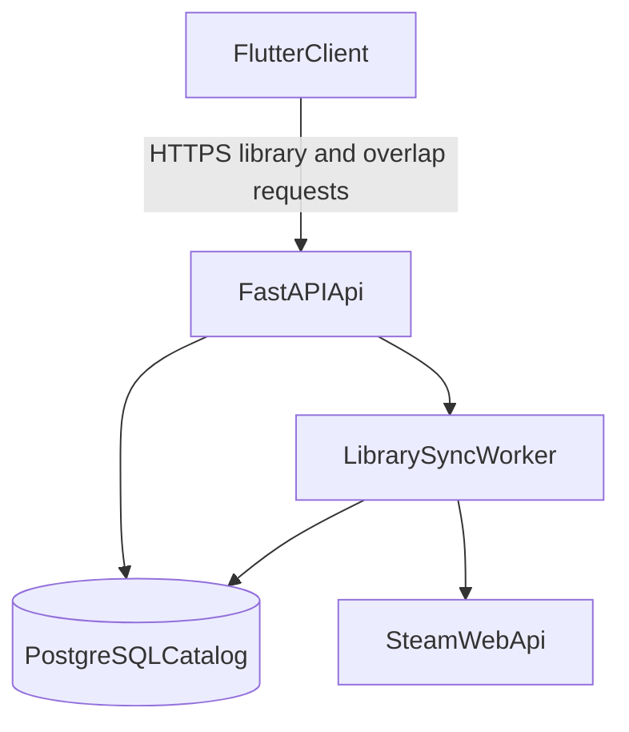

# InGame -- Game Matching Design Spec

> Part of the [InGame Product Roadmap](roadmap.md)

## Overview

This spec covers **Sub-Project 3: Game Matching**. It builds on the Core Platform foundation from [2026-05-30-core-platform-design.md](2026-05-30-core-platform-design.md) and the realtime coordination overview from [2026-05-30-real-time-coordination-design.md](2026-05-30-real-time-coordination-design.md).

SP3 gives InGame a durable, provider-agnostic game domain so members can compare what they own, discover common titles, and eventually connect shared libraries to coordination features. Steam is the first provider, but the data model must remain generic rather than baking Steam assumptions into every table and API.

---

## Goals

- build a **generic game catalog** that can outlive any single provider integration
- sync a member's owned games from linked providers, starting with Steam
- let group members see **games in common** and identify overlaps worth playing together
- derive **genres from game metadata** rather than allowing manual freeform genre creation
- keep future coordination features free to reference a canonical game or genre without re-modeling this domain later

---

## Scope

### In Scope
- canonical game catalog
- provider-specific ingestion, starting with Steam owned-games sync
- user-owned game library storage and refresh lifecycle
- derived genre metadata attached to games
- profile/group UI for owned games and common games
- permissions/privacy rules for library visibility within groups
- graceful behavior when a required provider account is unlinked

### Out of Scope
- push notifications about library changes (SP4)
- public matchmaking across strangers (SP5)
- manual freeform genre creation by users
- reusing recurring availability (`preferred_gaming_hours`) as if it were a game-preference model

---

## Product Rules

- The game library domain is **generic first, provider-specific second**.
- Steam is the first ingestion source, but the app must not assume every game comes from Steam forever.
- Genres are **catalog metadata**, not arbitrary user-entered tags.
- A member's "games in common" view is computed from durable ownership data, not from ephemeral ready-state data.
- Steam-backed library features require an active linked `steam_id`; unlinking Steam removes access to Steam-derived library sync until the provider is relinked.
- Future coordination surfaces may reference a selected game or genre from this catalog, but SP3 owns the catalog and ownership data itself.

---

## Architecture

### Core Principles
- PostgreSQL stores durable game, genre, and ownership data.
- Provider integrations normalize into the shared catalog instead of leaking provider-specific schemas to Flutter.
- Sync jobs are idempotent and safe to rerun.
- Group overlap views are computed from stored ownership data and do not require live provider calls during normal page loads.

---

## Data Model

### PostgreSQL Tables

**Game**
| Column | Type | Notes |
|--------|------|-------|
| id | UUID | Primary key |
| canonical_name | VARCHAR | User-facing display name |
| slug | VARCHAR | Stable internal identifier |
| cover_image_url | VARCHAR | Nullable |
| created_at | TIMESTAMP | Auto-set |
| updated_at | TIMESTAMP | Auto-updated |

**GameGenre**
| Column | Type | Notes |
|--------|------|-------|
| id | UUID | Primary key |
| slug | VARCHAR | Stable internal identifier |
| display_name | VARCHAR | User-facing label |
| created_at | TIMESTAMP | Auto-set |

**GameGenreAssignment**
| Column | Type | Notes |
|--------|------|-------|
| game_id | UUID | FK -> Game |
| genre_id | UUID | FK -> GameGenre |
| source | VARCHAR | Metadata source, e.g. `steam` |
| Unique constraint | | `(game_id, genre_id, source)` |

**GameProviderLink**
| Column | Type | Notes |
|--------|------|-------|
| id | UUID | Primary key |
| game_id | UUID | FK -> Game |
| provider | VARCHAR | `steam` initially |
| external_id | VARCHAR | Provider-native game/app identifier |
| raw_name | VARCHAR | Provider-supplied title for auditing |
| raw_payload | JSONB | Nullable metadata snapshot |
| updated_at | TIMESTAMP | Auto-updated |
| Unique constraint | | `(provider, external_id)` |

**UserGame**
| Column | Type | Notes |
|--------|------|-------|
| id | UUID | Primary key |
| user_id | UUID | FK -> User |
| game_id | UUID | FK -> Game |
| provider | VARCHAR | Source provider for the ownership record |
| external_owner_id | VARCHAR | Provider account ID used for the sync, e.g. Steam ID |
| playtime_minutes | INTEGER | Nullable provider metadata |
| last_synced_at | TIMESTAMP | Timestamp of latest successful sync |
| created_at | TIMESTAMP | Auto-set |
| updated_at | TIMESTAMP | Auto-updated |
| Unique constraint | | `(user_id, game_id, provider)` |

### Ownership Semantics
- `Game` is the canonical app-wide entity.
- `GameProviderLink` maps provider-native identifiers into the canonical catalog.
- `UserGame` records that a user owns a canonical game through a specific provider.
- A later provider can point at the same `Game` without duplicating the catalog row.

---

## Sync And Unlink Lifecycle

### Steam Sync
- Steam is the first supported provider.
- Sync uses the linked user's `steam_id` plus Steam Web API owned-games endpoints.
- Sync normalizes provider app IDs into `GameProviderLink`, then upserts `UserGame`.
- Sync should be manually triggerable from profile/library surfaces and safe to run in the background later.

### Unlink Behavior
- Unlinking Steam from profile disables Steam-backed library refresh immediately.
- Steam-derived `UserGame` visibility behavior must be explicit:
  - either keep previously synced records but mark them stale/unrefreshable, or
  - remove Steam-derived ownership records on unlink.
- The chosen behavior must stay consistent across API, UI copy, and privacy semantics.
- Until another provider exists, common-games views that rely solely on Steam should clearly explain when overlap data is unavailable because Steam is not linked.

---

## API Contract

### REST Endpoints (Planned)
- `GET /api/v1/users/me/games`
- `POST /api/v1/users/me/games/sync-steam`
- `GET /api/v1/users/{user_id}/games`
- `GET /api/v1/groups/{group_id}/games/common`
- `GET /api/v1/games`
- `GET /api/v1/games/{game_id}`
- `GET /api/v1/genres`

### Response Shapes (Planned)

**UserGameResponse**
| Field | Type | Notes |
|-------|------|-------|
| game_id | UUID | Canonical game ID |
| name | String | Canonical display name |
| cover_image_url | String? | Nullable |
| genres | List[String] | Derived display names |
| provider | String | `steam` initially |
| playtime_minutes | int? | Nullable |
| last_synced_at | DateTime | |

**CommonGameResponse**
| Field | Type | Notes |
|-------|------|-------|
| game_id | UUID | Canonical game ID |
| name | String | Canonical display name |
| cover_image_url | String? | Nullable |
| genres | List[String] | Derived display names |
| owner_count | int | Members in the group who own the game |
| owners | List[Object] | Lightweight member list for overlap explanation |

---

## Flutter Architecture

### Primary Surfaces
- profile-owned games section
- optional dedicated personal library screen
- group "games in common" surface
- later coordination pickers can consume the same `Game` / `Genre` entities without redefining them

### UX Rules
- Game and genre labels come from catalog data, not handwritten freeform user input.
- Common-games views should prioritize overlap clarity over exhaustive metadata.
- Provider-dependent actions must explain why they are unavailable when the provider is unlinked.

---

## Privacy And Visibility

- Group members may view overlap/common-games data only within groups they share.
- Broader public library visibility controls belong with SP4 privacy settings, but SP3 must be designed so that those future controls can hide or scope user libraries cleanly.
- Until broader privacy controls exist, library features should default to the minimum sharing needed for the current private-group use case.

---

## Testing Strategy

### Backend
- catalog normalization tests
- provider-link upsert tests
- Steam owned-games sync tests
- unlink behavior tests for Steam-derived library access
- common-games overlap tests for groups with mixed ownership

### Flutter
- repository tests for library/common-games endpoints
- provider tests for sync state and filtering
- widget tests for profile library and group overlap surfaces

### Contract
- API/spec validation for canonical game and common-games response shapes

---

## Change Log

| Date | Section | Change | Reason |
|------|---------|--------|--------|
| 2026-06-02 | Initial spec | Created the SP3 Game Matching spec with a generic game catalog, provider-specific ingestion model, Steam-first library sync, common-games surfaces, and unlink/privacy constraints | Gives game-library and overlap work its own maintained contract instead of leaving it only as a roadmap stub |
