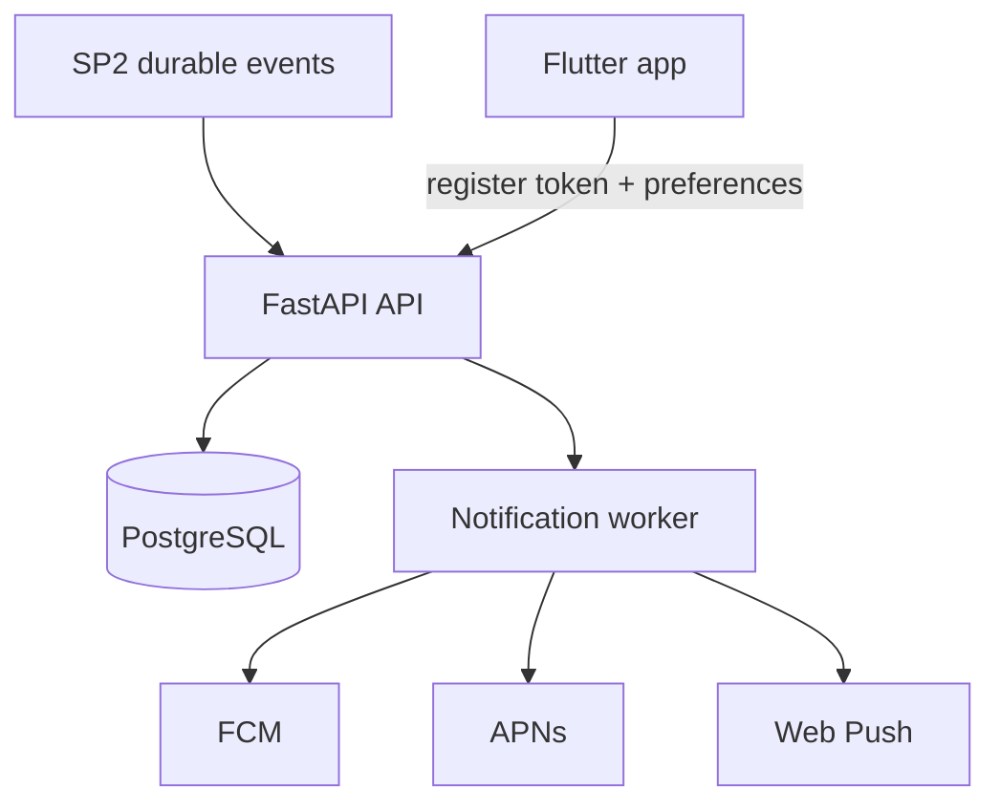

# InGame -- Notifications Design Spec

> Part of the [InGame Product Roadmap](roadmap.md)

## Overview

This spec covers **Sub-Project 3: Settings & Notifications**. It builds on the completed realtime coordination foundation from [2026-05-30-real-time-coordination-design.md](2026-05-30-real-time-coordination-design.md) and defines the notification infrastructure, preferences, and settings boundaries needed before broader public-facing matching features.

SP3 turns delivered coordination events into useful offline follow-through while also creating the maintained home for account, privacy, and app-preference settings.

## Goals

- deliver push notifications for important SP2 coordination events
- register and manage device/browser tokens safely across iOS, Android, and web
- let users control notification noise with event-type preferences, quiet hours, and per-group mute
- define the settings/profile/account boundary before the settings implementation starts
- keep the notification dispatch model reusable by later SP4 game-library and SP5 public-matching features

## Scope

### In Scope

- device token registration lifecycle
- push delivery architecture for iOS, Android, and web
- notification event ownership and dispatch rules
- quiet hours, per-group mute, and event-type preferences
- account/privacy/settings information architecture in Flutter
- backend delivery prerequisites and environment configuration

### Out of Scope

- in-app chat or inbox
- SMS or email notification delivery
- public-lobby or stranger-matching notifications from SP5
- redesigning SP2 event ownership or rewriting the delivered coordination data model

## Product Rules

- Notifications are triggered from durable backend events, not from client-only state.
- A notification must be suppressible by user preference before it reaches the delivery provider.
- Quiet hours mute delivery, not event creation; suppressed events are not retried later unless a future digest feature is explicitly added.
- Per-group mute overrides event-type defaults for that group.
- Settings and account-management surfaces must stay separate from the public-facing profile summary even when they are initially entered from profile.
- Web push may ship after mobile push if operational setup requires sequencing, but the spec keeps the token and preference model cross-platform from day one.

## Architecture

### Core Principles

- PostgreSQL stores device registrations and notification preferences.
- Dispatch happens server-side after evaluating preferences; clients do not self-notify.
- Mobile push uses platform-native providers: FCM for Android and APNs for iOS.
- Web push remains optional at rollout time but follows the same preference model when enabled.
- Notification event production stays decoupled from the transport provider so later digest/email work can reuse the same internal event ownership.

## Data Model

### DeviceRegistration

| Column | Type | Notes |
|--------|------|-------|
| `id` | UUID | Primary key |
| `user_id` | UUID | FK -> User |
| `platform` | VARCHAR | `ios`, `android`, `web` |
| `provider` | VARCHAR | `apns`, `fcm`, `webpush` |
| `token` | TEXT | Provider token / endpoint identifier |
| `device_label` | VARCHAR | Optional user-visible label |
| `app_version` | VARCHAR | Optional |
| `last_seen_at` | TIMESTAMP | Updated on refresh/register |
| `revoked_at` | TIMESTAMP? | Nullable soft revoke |
| Unique constraint | | `(user_id, provider, token)` |

### NotificationPreference

| Column | Type | Notes |
|--------|------|-------|
| `id` | UUID | Primary key |
| `user_id` | UUID | FK -> User |
| `group_id` | UUID? | Nullable for global defaults |
| `event_type` | VARCHAR | e.g. `ready_changed`, `session_proposed`, `join_request_pending`, `common_game_found` |
| `enabled` | BOOLEAN | On/off switch |
| `quiet_hours_start` | TIME? | Nullable |
| `quiet_hours_end` | TIME? | Nullable |
| `muted` | BOOLEAN | Group-level hard mute |
| `updated_at` | TIMESTAMP | Auto-updated |

### Initial Event Types

- `ready_changed`
- `session_proposed`
- `session_updated`
- `session_rsvp_updated`
- `join_request_pending`

SP4 may later add game-library event types without changing the base preference model.

## Token Registration Lifecycle

### Register / Refresh

- client obtains a provider token from the platform SDK
- client POSTs the token plus platform/provider metadata to the API
- backend upserts a `DeviceRegistration` row and updates `last_seen_at`
- repeated registration with the same token is idempotent

### Revoke

- logout revokes the active device registration for the current app install when possible
- token refresh replaces the stored token and revokes the superseded registration
- permanently invalid provider responses (unregistered token, bad endpoint) revoke the stored registration server-side

## API Contract

### REST Endpoints (Planned)

- `GET /api/v1/users/me/notification-preferences`
- `PUT /api/v1/users/me/notification-preferences`
- `POST /api/v1/users/me/device-registrations`
- `DELETE /api/v1/users/me/device-registrations/{registration_id}`
- `GET /api/v1/groups/{group_id}/notification-preferences`
- `PUT /api/v1/groups/{group_id}/notification-preferences`

### Request / Response Notes

- preference responses must include both global defaults and explicit group overrides
- device registration responses should return the normalized registration row so Flutter can keep local state aligned
- stable error codes are required for unsupported platform/provider combinations and invalid quiet-hours ranges

## Dispatch Rules

### SP2 Triggers

- `ready_changed`
  - notify offline group members when someone becomes ready
  - do not notify the actor
- `session_proposed`
  - notify all other group members unless muted
- `session_updated`
  - notify members who previously RSVPed `in` or `maybe`, plus owners/admins if relevant
- `session_rsvp_updated`
  - default to notifying the session proposer when another member changes RSVP
- `join_request_pending`
  - notify owners/admins for approval-mode groups

### Preference Evaluation Order

1. skip actor/self-notifications
2. load group-level mute override
3. load event-type enable/disable state
4. evaluate quiet hours in the user's timezone
5. dispatch to active device registrations

## Flutter Architecture

### Primary Surfaces

- dedicated settings entry point reachable from profile
- notification preferences section
- privacy/account management sections
- optional per-group notification controls from group settings later if product needs a shortcut

### Boundary Rules

- `profile_screen.dart` remains the public/self summary surface
- notification, privacy, and account-management controls should move into clearer settings routes/providers instead of indefinitely expanding profile
- user-facing text for notification previews and preference labels must be localized

## Platform And Delivery Prerequisites

- Firebase project and FCM credentials for Android (and web if web push ships in-scope)
- APNs entitlement/certificate or token-based auth for iOS
- iOS/Android platform shell wiring for permission prompts and token refresh callbacks
- web push service worker and browser permission flow if web push remains in the initial rollout
- backend secret/config handling for provider credentials in deployment environments

## Testing Strategy

### Backend

- token registration upsert/idempotency tests
- quiet-hours and per-group mute evaluation tests
- invalid-token revoke tests
- dispatch-rule tests for each supported event type

### Flutter

- repository/provider tests for token registration and preference updates
- widget tests for settings and notification preference surfaces
- platform smoke checks for permission + token bootstrap on iOS/Android/web as each target is enabled

## Change Log

| Date | Section | Change | Reason |
|------|---------|--------|--------|
| 2026-06-05 | Initial spec | Created the dedicated SP3 Notifications spec covering push architecture, token lifecycle, preference evaluation, and settings boundaries | Gives the newly renumbered SP3 a maintained contract before implementation begins |
