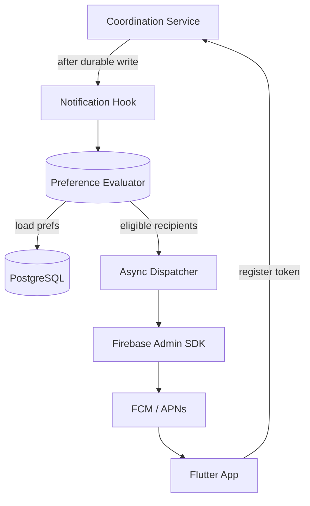

# InGame — Push Notifications Design Spec (SP3a)

> Part of the [InGame Product Roadmap](roadmap.md)

## Overview

This spec covers **SP3a: Push Notifications** — the first half of the original SP3 scope. It adds push notification delivery for SP2 coordination events so users who are offline still learn about group activity that matters to them.

SP3b (Settings & Account Management) is a separate follow-up that builds the user-facing preference UI, account management, and privacy controls on top of the preference data model defined here.

## Goals

- deliver push notifications for SP2 coordination events to offline group members
- register and manage device tokens across iOS and Android
- build a granular preference data model that SP3b settings UI can drive without schema changes
- dispatch notifications in-process via an async background task (no separate worker deployment)
- keep the notification hook reusable so SP4/SP5 event types plug in without changing the dispatcher

## Scope

### In Scope

- device token registration lifecycle (register, refresh, revoke)
- push delivery via FCM (Android) and APNs (iOS) using Firebase Admin SDK
- notification preference data model with global, per-event-type, per-group, and conditional filter granularity
- preference evaluation before dispatch (quiet hours, mute, event-type toggles, conditional filters)
- integration hook in existing SP2 event production (coordination service + WebSocket manager)
- Flutter platform wiring: `firebase_messaging` plugin, token bootstrap, foreground/background handling
- backend `firebase-admin` SDK integration
- console setup instructions for Firebase project and Apple `.p8` key

### Out of Scope

- settings/account management UI (SP3b)
- in-app notification inbox or history
- web push (deferred — same preference model, add later)
- SMS or email delivery
- notification grouping, batching, or digest

## Architecture



### Core Principles

- Notifications are triggered from durable backend events, not client state.
- Dispatch is non-blocking: the API response returns immediately; an `asyncio.create_task` handles delivery.
- Preference evaluation happens server-side before any provider call.
- The preference model is write-once for SP3a (sensible defaults, no UI) — SP3b adds the settings screens.
- Token-based APNs auth (`.p8` key) — no expiry, simpler config.
- FCM is used as the unified transport for both Android and iOS via the Firebase Admin SDK (FCM wraps APNs for iOS automatically when the APNs key is configured in Firebase Console).

## Data Model

### DeviceRegistration

| Column | Type | Notes |
|--------|------|-------|
| `id` | UUID | Primary key |
| `user_id` | UUID | FK → users |
| `platform` | VARCHAR(16) | `ios`, `android`, `web` |
| `token` | TEXT | FCM registration token |
| `device_label` | VARCHAR(128) | Optional user-visible label |
| `app_version` | VARCHAR(32) | Optional, for future targeting |
| `last_seen_at` | TIMESTAMPTZ | Updated on register/refresh |
| `revoked_at` | TIMESTAMPTZ? | Nullable soft-revoke |
| Unique | | `(user_id, token)` |

Since FCM is the sole transport (it handles APNs delivery when the iOS app registers through Firebase), we store FCM tokens only — no separate `provider` column needed.

### NotificationPreference

| Column | Type | Notes |
|--------|------|-------|
| `id` | UUID | Primary key |
| `user_id` | UUID | FK → users |
| `scope` | VARCHAR(32) | `global`, `group`, `event_type` |
| `scope_id` | UUID? | group_id when scope=`group`, null for global |
| `event_type` | VARCHAR(64)? | Null for scope-wide defaults |
| `enabled` | BOOLEAN | Default true |
| `conditions` | JSONB? | Nullable structured filter (see below) |
| `quiet_hours_start` | TIME? | In user's timezone |
| `quiet_hours_end` | TIME? | In user's timezone |
| `quiet_hours_tz` | VARCHAR(64)? | IANA timezone identifier |
| `updated_at` | TIMESTAMPTZ | Auto-updated |
| Unique | | `(user_id, scope, scope_id, event_type)` |

### Conditions JSONB Schema

The `conditions` column supports structured filters that SP3b's settings UI will expose. Initial supported filters:

```json
{
  "only_if_rsvp": ["in", "maybe"],
  "only_if_role": ["owner", "admin"],
  "min_rsvp_count": 3
}
```

- `only_if_rsvp` — for `session_updated` / `session_rsvp_updated`: only notify if user's current RSVP is one of these values
- `only_if_role` — only notify users with these group roles
- `min_rsvp_count` — only notify if the session has at least N positive RSVPs

New condition keys can be added without schema migration. The evaluator ignores unknown keys (forward-compatible).

### Default Preferences

On first token registration, if no preferences exist for the user, seed these defaults:

| event_type | enabled | conditions |
|------------|---------|------------|
| `ready_changed` | true | — |
| `session_proposed` | true | — |
| `session_updated` | true | `{"only_if_rsvp": ["in", "maybe"]}` |
| `session_rsvp_updated` | true | — |
| `join_request_pending` | true | `{"only_if_role": ["owner", "admin"]}` |

These provide sensible noise reduction out of the box. SP3b lets users customize.

### Event Types

Supported in SP3a:

| Event Type | Trigger | Default Recipients |
|------------|---------|-------------------|
| `ready_changed` | User toggles ready | Other group members who are offline |
| `session_proposed` | New session created | All other group members |
| `session_updated` | Session details changed | Members who RSVPed `in` or `maybe` |
| `session_rsvp_updated` | RSVP changed | Session proposer |
| `join_request_pending` | Join request submitted | Group owners and admins |

SP4 will add game-library event types using the same model.

## Token Registration Lifecycle

### Register / Refresh

1. Flutter app initializes `firebase_messaging`, requests permission, obtains FCM token
2. App calls `POST /api/v1/users/me/device-registrations` with `{platform, token}`
3. Backend upserts `DeviceRegistration` by `(user_id, token)`, updates `last_seen_at`
4. On token refresh callback, Flutter calls the same endpoint — old token is superseded
5. If no `NotificationPreference` rows exist for the user, seed defaults

### Revoke

- On logout: `DELETE /api/v1/users/me/device-registrations/{id}` or revoke by token
- On token refresh: previous token's registration gets `revoked_at` set
- On FCM delivery failure with `UNREGISTERED` or `INVALID_ARGUMENT`: server-side revoke

### Stale Token Cleanup

Registrations where `last_seen_at` is older than 60 days and `revoked_at` is null are candidates for cleanup. A periodic janitor (same pattern as `avatar_upload_janitor`) soft-revokes them.

## API Contract

### Device Registration

```
POST   /api/v1/users/me/device-registrations
DELETE /api/v1/users/me/device-registrations/{registration_id}
GET    /api/v1/users/me/device-registrations
```

#### POST Request

```json
{
  "platform": "ios",
  "token": "fcm-token-string",
  "device_label": "iPhone 17",
  "app_version": "1.0.0"
}
```

#### POST Response (201 or 200 on upsert)

```json
{
  "id": "uuid",
  "platform": "ios",
  "token": "fcm-token-string",
  "device_label": "iPhone 17",
  "last_seen_at": "2026-06-13T10:00:00Z"
}
```

### Notification Preferences (SP3a: read + seed only; SP3b adds PUT)

```
GET /api/v1/users/me/notification-preferences
GET /api/v1/groups/{group_id}/notification-preferences
```

Response includes all preference rows for the user (global + group overrides). SP3b adds `PUT` endpoints for mutation.

## Dispatch Architecture

### Hook Point

After each durable coordination write in `coordination/service.py`, call a notification hook:

```python
await enqueue_notification(
    event_type="session_proposed",
    group_id=group_id,
    actor_user_id=actor.id,
    payload={...event-specific data...},
)
```

`enqueue_notification` is a thin function that spawns an `asyncio.create_task` — the same in-process pattern as the avatar upload janitor. No Redis queue needed; if the process dies mid-dispatch, the notification is lost (acceptable for push — these are ephemeral alerts, not durable messages).

### Dispatcher Flow

```python
async def dispatch_notification(event_type, group_id, actor_user_id, payload):
    # 1. Load group members (exclude actor)
    # 2. For each member:
    #    a. Load their notification preferences
    #    b. Evaluate: enabled? muted? quiet hours? conditions match?
    #    c. If eligible, load their active device registrations
    #    d. Send FCM message per device
    # 3. Handle FCM errors (revoke invalid tokens)
```

### Preference Evaluation Order

1. **Skip actor** — never self-notify
2. **Group mute** — check for scope=`group` preference with `enabled=false`
3. **Event type** — check for matching event_type preference, fall back to global default
4. **Conditions** — evaluate JSONB conditions against event context (RSVP status, role, etc.)
5. **Quiet hours** — check user's quiet hours in their configured timezone
6. **Dispatch** — send to all active (non-revoked) device registrations

### FCM Message Format

```python
message = messaging.Message(
    notification=messaging.Notification(
        title=title,       # e.g. "Gaming Session Proposed"
        body=body,         # e.g. "Alex proposed a Valorant session for tomorrow at 8 PM"
    ),
    data={
        "event_type": event_type,
        "group_id": str(group_id),
        "deep_link": f"/groups/{group_id}/coordination",
    },
    token=device_token,
)
```

### Notification Copy

| Event Type | Title | Body |
|------------|-------|------|
| `ready_changed` | `{name} is ready to play` | `{name} is ready in {group_name}` |
| `session_proposed` | `New session in {group_name}` | `{name} proposed: {title or game} — {formatted_time}` |
| `session_updated` | `Session updated in {group_name}` | `{name} updated: {title or game}` |
| `session_rsvp_updated` | `RSVP update in {group_name}` | `{name} is now {response} for {title or game}` |
| `join_request_pending` | `Join request in {group_name}` | `{name} wants to join {group_name}` |

These are backend-generated (not localized per-device in SP3a). Localized push copy can be added in a future iteration using FCM's localization keys.

## Flutter Integration

### Dependencies

Add to `pubspec.yaml`:
- `firebase_core`
- `firebase_messaging`

### Initialization

```
main.dart:
  await Firebase.initializeApp()

NotificationService (new shared service):
  - requestPermission()
  - getToken() → register with backend
  - onTokenRefresh → re-register
  - onMessage (foreground) → show local notification or in-app indicator
  - onBackgroundMessage → handle silently
```

### Platform Setup

#### iOS (manual steps — instructions for user)

1. **Apple Developer Portal**: Generate APNs Authentication Key (`.p8`)
   - Go to Certificates, Identifiers & Profiles → Keys → Create Key
   - Enable "Apple Push Notifications service (APNs)"
   - Download the `.p8` file, note the Key ID and Team ID
2. **Firebase Console**: Create project → Add iOS app → Upload `.p8` key under Cloud Messaging settings
3. **Xcode**: Add Push Notifications capability and Background Modes (Remote notifications) to `Runner.entitlements`

#### Android (manual steps — instructions for user)

1. **Firebase Console**: Add Android app with package name → Download `google-services.json` to `android/app/`
2. No additional Android manifest changes needed — `firebase_messaging` plugin handles it

#### Backend

1. **Firebase Console**: Generate a service account key (JSON) under Project Settings → Service Accounts
2. Store as `FIREBASE_SERVICE_ACCOUNT_JSON` env var (or mount as file)
3. Add `firebase-admin` to `requirements.txt`

### Flutter File Structure

```
lib/
  features/
    notifications/
      data/
        notification_repository.dart      # API calls for device registration
      domain/
        device_registration_model.dart    # Freezed model
      presentation/
        providers/
          notification_provider.dart      # Token lifecycle management
  shared/
    services/
      notification_service.dart           # Firebase init, permission, token mgmt
```

### Token Bootstrap Flow

```
App start
  → Firebase.initializeApp()
  → NotificationService.initialize()
    → requestPermission() (first launch shows OS prompt)
    → getToken()
    → POST to /device-registrations
    → listen onTokenRefresh → re-POST
```

### Foreground Notifications

When the app is in the foreground and a push arrives, `onMessage` fires. In SP3a, show a brief in-app toast/snackbar using the existing `AppToast` widget — no full notification UI. SP3b can add richer in-app handling.

## Backend File Structure

```
backend/app/
  notifications/
    __init__.py
    dispatcher.py          # enqueue_notification + dispatch_notification
    evaluator.py           # preference loading + evaluation logic
    fcm.py                 # Firebase Admin SDK wrapper (initialize, send)
    copy.py                # Notification title/body generation
  db/
    models/
      device_registration.py
      notification_preference.py
    repositories/
      device_registration_repo.py
      notification_preference_repo.py
    migrations/versions/
      xxxx_add_device_registrations.py
      xxxx_add_notification_preferences.py
  api/v1/
    notifications/
      routes.py            # Device registration + preference GET endpoints
      schemas.py           # Pydantic request/response models
  jobs/
    stale_token_janitor.py # Periodic cleanup of old device registrations
```

## Configuration

### Environment Variables (new)

| Variable | Description | Required |
|----------|-------------|----------|
| `FIREBASE_SERVICE_ACCOUNT_JSON` | Firebase service account key (JSON string or file path) | Yes (for push) |
| `NOTIFICATIONS_ENABLED` | Master kill switch, default `true` | No |
| `NOTIFICATIONS_DRY_RUN` | Log instead of sending, default `false` | No |

### Helm / Docker Compose

- Add `FIREBASE_SERVICE_ACCOUNT_JSON` to configmap/secret
- Add `NOTIFICATIONS_ENABLED` and `NOTIFICATIONS_DRY_RUN` to values.yaml with sensible defaults
- No new containers or services needed

## Testing Strategy

### Backend

- **Unit**: preference evaluator tests — quiet hours, mute, conditions, role filters, RSVP filters
- **Unit**: notification copy generation for each event type
- **Unit**: device registration upsert, revoke, stale cleanup
- **Integration**: dispatch flow with mocked FCM client — verify correct recipients receive messages
- **Integration**: token registration API endpoint tests

### Flutter

- **Unit**: notification repository tests (mock Dio)
- **Unit**: notification provider token lifecycle tests
- **Widget**: permission prompt handling (mocked firebase_messaging)

### Manual Verification (instructions for user)

- Install on physical iOS device, verify permission prompt appears
- Trigger `session_proposed` from another account, verify push arrives
- Background the app, verify push arrives as system notification
- Tap notification, verify deep link opens coordination screen

## Dependencies on Existing Code

### Coordination Service (modify)

Add `enqueue_notification()` calls after each durable write in `app/api/v1/coordination/service.py`:
- After `_record_activity()` for `scheduled_ready_updated` → `ready_changed` notification
- After `_record_activity()` for `session_proposed` → `session_proposed` notification
- After `_record_activity()` for `session_updated` → `session_updated` notification
- After `_record_activity()` for `session_rsvp_updated` → `session_rsvp_updated` notification

### Join Requests (modify)

Add `enqueue_notification()` after join request creation for `join_request_pending`.

### Main.py (modify)

- Import and call `initialize_firebase()` during lifespan startup
- Add stale token janitor task alongside existing avatar upload janitor

### DB Models __init__.py (modify)

- Register new `DeviceRegistration` and `NotificationPreference` models

## SP3b Handoff

SP3a delivers the full preference data model and evaluation engine. SP3b adds:

- `PUT /api/v1/users/me/notification-preferences` endpoint
- `PUT /api/v1/groups/{group_id}/notification-preferences` endpoint
- Flutter settings screens for global preferences, per-group mute, quiet hours, event-type toggles, and conditional filters
- Account management (password change, deletion, data export)
- Privacy settings (online status visibility, game library visibility)

No schema migrations needed in SP3b — the `NotificationPreference` table and `conditions` JSONB are ready.

## Change Log

| Date | Section | Change | Reason |
|------|---------|--------|--------|
| 2026-06-13 | Initial spec | Split SP3 into SP3a (push notifications) and SP3b (settings/account); wrote dedicated push notification spec | Reduce scope per sub-project; push is higher priority than settings UI |
| 2026-06-14 | Device Registration | Added `web` as valid platform; web push via FCM service worker + VAPID key | Extend notifications to web app users |
