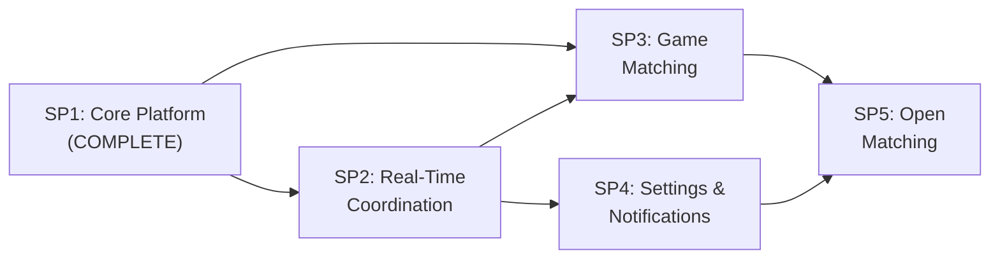

# InGame -- Product Roadmap

## Vision

InGame is a social gaming coordination app that makes it easy to find time to play video games with friends. It solves the core problem of aligning gaming schedules by letting users signal availability, coordinate sessions, and discover compatible gaming partners -- starting with private friend groups and eventually expanding to public matchmaking.

## Architecture Overview

```
Flutter Clients (iOS, Android, Web)
    |                        |
    | REST (HTTPS)           | WebSocket (WSS)
    v                        v
FastAPI Server (single process, REST + WS endpoints)
    |           |            |
    v           v            v
PostgreSQL    Redis       External Services
(persistent   (real-time   (Steam API, Apple Auth,
 data)         state,       FCM/APNs, future
               pub/sub)     integrations)
```

Full architectural details are documented in the [Core Platform spec](2026-05-30-core-platform-design.md).

**Tech stack:** Flutter 3.44 / Dart 3.12, FastAPI (Python), PostgreSQL 16, Redis 7, OpenShift + ArgoCD.

---

## Sub-Project Overview



| # | Sub-Project | Status | Spec | Depends On |
|---|-------------|--------|------|------------|
| 1 | Core Platform | Complete | [spec](2026-05-30-core-platform-design.md) | -- |
| 2 | Real-Time Coordination | Planned | [spec](2026-05-30-real-time-coordination-design.md) | SP1 |
| 3 | Game Matching | Planned | -- | SP1, SP2 |
| 4 | Settings & Notifications | Planned | -- | SP2 |
| 5 | Open Matching (V2) | Planned | -- | SP3, SP4 |

---

## Sub-Project Details

### SP1: Core Platform (COMPLETE)

**Goal:** Build the foundational layer -- authentication, user profiles, group management -- that all other features depend on.

**Key features delivered:**
- Email/password, Steam OAuth (OpenID 2.0), and Apple Sign-In authentication
- Account linking (connect/disconnect Steam and Apple from profile)
- Add email/password for social-only users; unlink lockout guard
- User profiles with gaming hours (intelligent schedule display), bio, avatar
- Groups with invite codes, discoverable directory, join requests with admin approval
- First-time user onboarding wizard (3-step)
- Hybrid persistent navigation: sidebar/bottom nav stays visible during browsing; focused flows (auth, onboarding) hide nav
- Reusable `InGameLogo` brand widget with gradient styling
- Platform-authentic social login buttons (Steam brand palette, Apple HIG)
- Glassmorphism design system with Cue-backed shared motion surfaces (`GlassCard`, `AppToast`, social hover states, onboarding interactions, `StatusIndicator`) plus existing page transitions where retained
- Helm chart + Kustomize overlays for OpenShift deployment
- 34 backend tests (auth, users, groups, WebSocket)

**Spec:** [docs/specs/2026-05-30-core-platform-design.md](2026-05-30-core-platform-design.md) (v2.21)

---

### SP2: Real-Time Coordination

**Goal:** Let users signal "ready to game" and coordinate gaming sessions with their groups in real time.

**Key features:**
- **Status broadcasting** -- users set their status to ready/online/away/offline; status is broadcast to all group members via WebSocket in real time
- **Group presence** -- group detail screen shows who's currently online and who's ready to play, with live updates
- **Session scheduling** -- propose a future time slot for a gaming session; group members RSVP (in/out/maybe); reminders when session is approaching
- **Activity feed** -- lightweight event stream in each group (e.g., "Alex is ready to game", "Session proposed for tonight 8 PM")

**Technical scope:**
- Redis pub/sub channels per group for real-time event fan-out
- WebSocket event handlers for status changes, session proposals, RSVPs
- `StatusIndicator` widget integration (already built in SP1, needs wiring to live data)
- New data models: `Session` (proposed time, game, RSVPs), status state machine
- Backend: status store in Redis, session CRUD in PostgreSQL
- Flutter: real-time providers that listen to WebSocket events and update UI

**Depends on:** SP1

**Estimated effort:** Medium-large (core feature of the app, involves real-time infrastructure)

**Spec:** [docs/specs/2026-05-30-real-time-coordination-design.md](2026-05-30-real-time-coordination-design.md) (v1.0)

---

### SP3: Game Matching

**Goal:** Help friends find games they can play together by syncing game libraries and surfacing common titles.

**Key features:**
- **Steam library sync** -- pull a user's owned games via the Steam Web API (using their linked `steam_id`); periodic background refresh
- **Game library display** -- show owned games on user profiles; browsable/searchable
- **Games in common** -- group view showing which games all (or N) members own, sorted by overlap count
- **Genre/preference tagging** -- users tag favorite genres or games; used to suggest groups in the directory and improve matching
- **Game suggestions** -- "You and 3 others own Valheim -- play together?"

**Technical scope:**
- Steam Web API integration (`IPlayerService/GetOwnedGames`, `ISteamApps/GetAppList` for metadata)
- `Game` data model (app_id, name, icon, genres) and `UserGame` junction table
- Background sync worker (could use Celery/ARQ or a simple async task runner)
- Matching algorithm: group members' libraries intersected, ranked by recency/playtime
- Flutter: game library screen, games-in-common group view, preference editor

**Depends on:** SP1, SP2 (uses online status to highlight "ready to play" users who share a game)

**Estimated effort:** Medium (Steam API integration is well-documented; matching logic is straightforward)

---

### SP4: Settings & Notifications

**Goal:** Push notifications for offline users and comprehensive user settings/preferences.

**Key features:**
- **Push notifications (FCM/APNs)** -- notify offline users when someone in their group goes "ready to game", when a session is proposed, when a join request needs approval
- **Notification preferences** -- per-group mute, quiet hours (don't notify between 11 PM - 8 AM), toggle by event type (status changes, sessions, join requests)
- **Account management** -- change password, account deletion (GDPR compliance), export user data
- **Privacy settings** -- control who can see online status, game library visibility (friends only / public)
- **App preferences** -- theme selection (if we add light mode), default status on app open

**Technical scope:**
- Firebase Cloud Messaging (FCM) for Android/web, APNs for iOS
- Device token registration endpoint, notification dispatch service
- Notification preferences data model (per-user, per-group overrides)
- Settings screens in Flutter (notification, privacy, account sections)
- Backend: notification worker that checks preferences before dispatching

**Rationale for being a separate sub-project:** Push notifications are a cross-cutting concern needed by SP2 and SP3 but involve significant platform-specific setup (FCM project, APNs certificates, entitlements). Bundling with SP2 would make it too large. Account management and privacy settings are also prerequisites before any public-facing features in SP5.

**Depends on:** SP2 (notifications are triggered by real-time events)

**Estimated effort:** Medium (FCM/APNs setup is boilerplate-heavy but well-documented; settings UI is straightforward)

---

### SP5: Open Matching (V2)

**Goal:** Expand beyond friend groups to public matchmaking -- find gaming partners by language, region, game, and schedule.

**Key features:**
- **Public lobbies** -- time-limited open sessions that anyone can join (filtered by game, region, language)
- **Smart matching** -- algorithm considers schedule overlap, game library, language, region, and play style
- **Language/region filtering** -- users set preferred languages and region; matching respects these
- **Trust & safety** -- user reporting, content moderation queue, temporary/permanent bans, reputation score
- **Rating system** -- post-session feedback ("good teammate" / "no-show") feeds into reputation

**Technical scope:**
- Matching algorithm (likely a scoring/ranking system, not ML at this stage)
- Moderation service with admin dashboard
- Public session data model (extends the SP2 session model with visibility and capacity)
- Reputation/trust score model
- Flutter: public lobby browser, match suggestions screen, report flow, admin moderation UI
- Content policy definition and enforcement

**Depends on:** SP3 (game library data for matching), SP4 (notification infrastructure, privacy/account controls)

**Estimated effort:** Large (trust/safety and public matchmaking are complex; moderation requires ongoing operational work)

---

## Cross-Cutting Concerns

These patterns and practices apply across all sub-projects:

**Spec-driven development:** Every sub-project starts with a design spec (like [the Core Platform spec](2026-05-30-core-platform-design.md)). Implementation follows the spec. The spec is updated in the same response as any code change that affects API, data models, UI flows, or architecture. Enforced by `.cursor/rules/spec-driven-development.mdc`.

**Design system:** All UI follows the glassmorphism design system defined in SP1 -- dark gradients, translucent glass surfaces, electric blue primary accent. Components: `GlassCard`, `GlassButton`, `GlassInput`, `GlassAppBar`, `AdaptiveShell`, `StatusIndicator`. New sub-projects extend but don't replace this system.

**Testing strategy:** Each sub-project adds tests covering its scope. Backend uses pytest + httpx AsyncClient + SQLite test DB. Flutter uses Riverpod test utilities for providers and widget tests. CI runs all tests on PR.

**Deployment:** Runtime changes deploy via the Helm charts at `deploy/helm/ingame-api/` and `deploy/helm/ingame-web/`, with Kustomize overlays for dev/staging/prod. ArgoCD auto-syncs from the GitOps repo.

**API contract:** Backend Pydantic schemas are the source of truth. Flutter Freezed models must match the API response shapes. CI validates this alignment.

---

## Change Log

| Date | Change | Detail |
|------|--------|--------|
| 2026-05-30 | Initial roadmap created | 5 sub-projects defined; SP1 complete, SP2-SP5 planned |
| 2026-05-30 | SP1 polish additions | Added: InGameLogo widget, platform-authentic social buttons, hybrid persistent navigation, email/password for social users, unlink lockout guard, intelligent gaming hours display |
| 2026-05-30 | SP1 Cue migration pass | Shared motion surfaces now use Cue where it has clear ROI: app debug tooling, GlassCard entry, AppToast show/hide, social hover states, and onboarding selection/step transitions |
| 2026-05-30 | SP1 Cue motion expansion | `StatusIndicator` ready pulse now uses Cue as well, while keeping the shared widget API stable for future real-time status integration |
| 2026-05-30 | SP2 spec added | Added the Real-Time Coordination spec and linked it from the roadmap so pre-SP2 stabilization and realtime implementation have a written contract |
| 2026-05-30 | SP1 flow audit fixes | Corrected the core spec reference version, updated backend test count to 34, and reflected the latest onboarding/invite flow fixes before final SP1 sign-off review |
| 2026-05-31 | Native invite-link setup | Switched the canonical invite domain to `in-game.app` and documented the iOS/Android app-link scaffolding plus remaining Android release-cert verification step |
| 2026-05-31 | Web deployment surfaces | Added a dedicated web runtime to the deployment shape so Compose and OpenShift can serve the Flutter web app plus `/.well-known/*` and later consume separately built GHCR images |
| 2026-05-31 | Release image workflows | Standardized on `pubspec.yaml` as the stack version source and added a release-prep-on-dev plus tag-publish-on-main workflow for GHCR images |
| 2026-05-31 | Split Helm charts | Separated the backend and web deployment charts so `ingame-api` and `ingame-web` each own their own runtime manifests |
