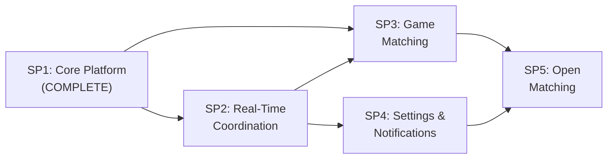

# InGame -- Product Roadmap

## Vision

InGame is a social gaming coordination app that makes it easy to find time to play video games with friends. It solves the core problem of aligning gaming schedules by letting users signal availability, coordinate sessions, and discover compatible gaming partners -- starting with private friend groups and eventually expanding to public matchmaking.

## Architecture Overview

```
Flutter Clients (iOS, Android, Web)
    |                        |
    | REST (HTTPS)           | WebSocket (WSS)
    v                        v
FastAPI Server (single process, REST + WS endpoints)
    |           |            |
    v           v            v
PostgreSQL    Redis       External Services
(persistent   (real-time   (Steam API, Apple Auth,
 data)         state,       FCM/APNs, future
               pub/sub)     integrations)
```

Full SP1 architectural details are documented in the [Core Platform overview](2026-05-30-core-platform-design.md) and its linked child specs.

**Tech stack:** Flutter 3.44 / Dart 3.12, FastAPI (Python), PostgreSQL 16, Redis 7, OpenShift + ArgoCD.

---

## Sub-Project Overview



| # | Sub-Project | Status | Spec | Depends On |
|---|-------------|--------|------|------------|
| 1 | Core Platform | Complete | [spec](2026-05-30-core-platform-design.md) | -- |
| 2 | Real-Time Coordination | In Progress | [spec](2026-05-30-real-time-coordination-design.md) | SP1 |
| 3 | Game Matching | Planned | [spec](2026-06-02-game-matching-design.md) | SP1, SP2 |
| 4 | Settings & Notifications | Planned | -- | SP2 |
| 5 | Open Matching (V2) | Planned | -- | SP3, SP4 |

---

## Sub-Project Details

### SP1: Core Platform (COMPLETE)

**Goal:** Build the foundational layer -- authentication, user profiles, group management -- that all other features depend on.

**Key features delivered:**
- Email/password, Steam OAuth (OpenID 2.0), and Apple Sign-In authentication
- Recovery email required by onboarding for every account, with auth-provided email prefill when available
- Account linking (connect/disconnect Steam and Apple from profile)
- Add email/password for social-only users; unlink lockout guard
- User profiles with gaming hours via a shared day-by-day preset editor (`Morning`, `Afternoon`, `Evening`, `Night`, `All day`), intelligent schedule display, bio, and a shared avatar editor that supports provider avatars, uploaded photos, camera capture, and URL entry while persisting only `avatar_url`
- Groups with invite codes, discoverable directory, join requests with admin approval, and full owner/admin/member RBAC management
- First-time user onboarding wizard (3-step) with optional recurring-availability capture using the same shared day-by-day preset editor as profile editing plus the same shared timezone selector used in profile editing
- English and German localization across the app shell, shared widgets, validators/error surfaces, and auth/onboarding/group/profile flows, with German catalog wording normalized for native spelling
- System-locale default with manual language switching on login and in profile preferences
- Structured backend error codes plus locale-reactive Flutter error/validation handling so persisted failures switch language without requiring a refetch or re-entry
- Route-aware redirect normalization for auth/onboarding return targets
- Hybrid persistent navigation: sidebar/bottom nav stays visible during browsing; focused flows (auth, onboarding) hide nav
- Desktop/web width-aware content framing: focused flows and shell pages use shared page-width archetypes (`compact`, `form`, `reading`, `wide`, opt-in `full`) so ultrawide layouts keep readable canvases while persistent navigation stays fixed
- Reusable `InGameLogo` brand widget with the canonical logo image plus gradient wordmark styling
- Platform-authentic social login buttons (Steam brand palette, Apple HIG)
- Glassmorphism design system with Cue-backed shared motion surfaces (`GlassCard`, `AppToast`, social hover states, onboarding interactions, `StatusIndicator`), themed popup menus, and existing page transitions where retained
- Platform-aware route pages so web keeps custom fade/slide while iOS/Android preserve native navigation gestures
- Helm chart + Kustomize overlays for OpenShift deployment
- Backend coverage across auth, users, groups, and realtime/WebSocket behavior

**Spec set:**
- [Overview](2026-05-30-core-platform-design.md) (v3.1)
- [Auth](2026-05-30-core-platform-auth.md) (v1.3)
- [Profiles](2026-05-30-core-platform-profiles.md) (v1.7)
- [Groups](2026-05-30-core-platform-groups.md) (v1.0)
- [Implementation](2026-05-30-core-platform-implementation.md) (v1.10)

---

### SP2: Real-Time Coordination

**Goal:** Let users signal "ready to game" and coordinate both short-horizon availability and group play plans with their groups in real time.

**Phase 1 (in progress): presence-first kickoff**
- **Derived connection presence** -- online/offline from WebSocket lifecycle; away from app background/inactive
- **Group-scoped ready** -- user-controlled ready toggle per group with 8-hour fallback expiry
- **App-wide live member status** -- member surfaces consume one presence provider contract

**Planned later in SP2:**
- **Scheduled ready windows** -- members can publish multiple future "ready to play" windows without creating a formal RSVP event
- **Group calendar views** -- shared calendar surfaces show scheduled ready windows and can optionally overlay each member's recurring profile availability from SP1
- **Session scheduling** -- propose a future time slot for a gaming session; group members RSVP (in/out/maybe); reminders when session is approaching
- **Activity feed** -- lightweight event stream in each group (e.g., "Alex is ready to game", "Session proposed for tonight 8 PM")

SP2 intentionally distinguishes two coordination models:
- **Scheduled personal readiness** -- "I expect to be ready at these times"
- **Session proposals** -- "Let's play this session together and RSVP"

**Technical scope:**
- Redis pub/sub channels per group for real-time event fan-out
- WebSocket event handlers for status changes, scheduled-ready updates, session proposals, RSVPs
- `StatusIndicator` widget integration (already built in SP1, needs wiring to live data)
- New data models: scheduled-ready windows for personal availability publication plus `Session` for explicit group proposals
- Backend: status store in Redis, scheduled-ready/session persistence in PostgreSQL where durable history is needed
- Flutter: real-time providers, ready scheduling flows, and calendar surfaces that listen to live updates and can combine SP2 events with SP1 recurring availability data

**Depends on:** SP1

**Estimated effort:** Medium-large (core feature of the app, involves real-time infrastructure)

**Spec set:**
- [Overview](2026-05-30-real-time-coordination-design.md) (v2.0)
- [Transport & Presence](2026-05-30-real-time-coordination-transport-presence.md) (v1.0)
- [Coordination Models](2026-05-30-real-time-coordination-coordination-models.md) (v1.0)
- [Implementation](2026-05-30-real-time-coordination-implementation.md) (v1.1)

---

### SP3: Game Matching

**Goal:** Help friends find games they can play together by building a generic game library, ingesting owned titles from linked providers, and surfacing common interests.

**Key features:**
- **Generic game catalog** -- durable shared catalog of games and derived genres that is not tied to one provider's schema
- **Provider-specific library sync** -- pull a user's owned games from linked providers, starting with the Steam Web API via `steam_id`
- **Game library display** -- show owned games on user profiles and group/library surfaces; browsable/searchable
- **Games in common** -- group view showing which games all (or N) members own, sorted by overlap count
- **Genre metadata from game data** -- genres come from catalog/provider metadata rather than manual freeform creation
- **Game suggestions** -- "You and 3 others own Valheim -- play together?"

**Technical scope:**
- Generic `Game`, `GameGenre`, and `UserGame` data models with provider link tables/identifiers where needed
- Steam Web API integration (`IPlayerService/GetOwnedGames`, `ISteamApps/GetAppList` for first-party ingestion and metadata bootstrap)
- Background sync worker (could use Celery/ARQ or a simple async task runner)
- Matching algorithm: group members' libraries intersected, ranked by overlap and freshness metadata
- Flutter: game library screen, games-in-common group view, and generic catalog-backed preference editor where needed

**Depends on:** SP1, SP2 (uses online status to highlight "ready to play" users who share a game)

**Estimated effort:** Medium (Steam API integration is well-documented; matching logic is straightforward)

**Spec:** [docs/specs/2026-06-02-game-matching-design.md](2026-06-02-game-matching-design.md) (v1.0)

---

### SP4: Settings & Notifications

**Goal:** Push notifications for offline users and comprehensive user settings/preferences.

**Key features:**
- **Push notifications (FCM/APNs)** -- notify offline users when someone in their group goes "ready to game", when a session is proposed, when a join request needs approval
- **Notification preferences** -- per-group mute, quiet hours (don't notify between 11 PM - 8 AM), toggle by event type (status changes, sessions, join requests)
- **Account management** -- change password, account deletion (GDPR compliance), export user data
- **Privacy settings** -- control who can see online status, game library visibility (friends only / public)
- **App preferences** -- theme selection (if we add light mode), default status on app open

**Technical scope:**
- Firebase Cloud Messaging (FCM) for Android/web, APNs for iOS
- Device token registration endpoint, notification dispatch service
- Notification preferences data model (per-user, per-group overrides)
- Settings screens in Flutter (notification, privacy, account sections)
- Backend: notification worker that checks preferences before dispatching

**Rationale for being a separate sub-project:** Push notifications are a cross-cutting concern needed by SP2 and SP3 but involve significant platform-specific setup (FCM project, APNs certificates, entitlements). Bundling with SP2 would make it too large. Account management and privacy settings are also prerequisites before any public-facing features in SP5.

**Depends on:** SP2 (notifications are triggered by real-time events)

**Estimated effort:** Medium (FCM/APNs setup is boilerplate-heavy but well-documented; settings UI is straightforward)

---

### SP5: Open Matching (V2)

**Goal:** Expand beyond friend groups to public matchmaking -- find gaming partners by language, region, game, and schedule.

**Key features:**
- **Public lobbies** -- time-limited open sessions that anyone can join (filtered by game, region, language)
- **Smart matching** -- algorithm considers schedule overlap, game library, language, region, and play style
- **Language/region filtering** -- users set preferred languages and region; matching respects these
- **Trust & safety** -- user reporting, content moderation queue, temporary/permanent bans, reputation score
- **Rating system** -- post-session feedback ("good teammate" / "no-show") feeds into reputation

**Technical scope:**
- Matching algorithm (likely a scoring/ranking system, not ML at this stage)
- Moderation service with admin dashboard
- Public session data model (extends the SP2 session model with visibility and capacity)
- Reputation/trust score model
- Flutter: public lobby browser, match suggestions screen, report flow, admin moderation UI
- Content policy definition and enforcement

**Depends on:** SP3 (game library data for matching), SP4 (notification infrastructure, privacy/account controls)

**Estimated effort:** Large (trust/safety and public matchmaking are complex; moderation requires ongoing operational work)

---

## Cross-Cutting Concerns

These patterns and practices apply across all sub-projects:

**Spec-driven development:** Every sub-project starts with a design spec set (for SP1, beginning with the [Core Platform overview](2026-05-30-core-platform-design.md) and its child specs). Implementation follows the relevant spec. The spec is updated in the same response as any code change that affects API, data models, UI flows, or architecture. Enforced by `.cursor/rules/spec-driven-development.mdc`.

**Design system:** All UI follows the glassmorphism design system defined in SP1 -- dark gradients, translucent glass surfaces, electric blue primary accent. Components: `GlassCard`, `GlassButton`, `GlassInput`, `GlassAppBar`, `AdaptiveShell`, `StatusIndicator`. Desktop/web single-column pages also use shared width archetypes (`compact`, `form`, `reading`, `wide`, opt-in `full`) so shells and focused flows stay readable on ultrawide displays. New sub-projects extend but don't replace this system.

**Localization:** User-facing Flutter copy is localized via Flutter's official `flutter_localizations + intl + gen_l10n` stack. English and German ARB catalogs live under `lib/l10n/`; widgets should use `context.l10n`, and non-widget helpers should use the locale-aware fallback accessor rather than inline English strings. This contract also covers shared widget copy plus supporting validator/error/helper text, and the German catalog should prefer natural `ä`, `ö`, `ü`, and `ß` forms when linguistically correct.

**Testing strategy:** Each sub-project adds tests covering its scope. Backend uses pytest + httpx AsyncClient + SQLite test DB. Flutter uses Riverpod test utilities for providers and widget tests. CI runs all tests on PR.

**Deployment:** Runtime changes deploy via the Helm charts at `deploy/helm/ingame-api/` and `deploy/helm/ingame-web/`, with Kustomize overlays for dev/staging/prod. ArgoCD auto-syncs from the GitOps repo. For image-based Docker hosts, `docker-compose.release.yml` provides a matching API + web + PostgreSQL + Redis stack without bundling ingress. Local compose now also includes MinIO plus avatar-bucket bootstrap and MinIO-level CORS so the S3-compatible avatar upload flow works end to end in development, while release compose now bundles MinIO by default for self-hosted installs even though the same API contract can still be repointed at another S3-compatible backend if operators intentionally customize the stack. The release MinIO bootstrap is now inlined in compose and runs through an explicit `/bin/sh -ec` entrypoint so Portainer-style stack deployers do not rely on repo-relative helper file mounts, multiline-shell parsing quirks, or the default `minio/mc` entrypoint. Storage runtime config may also split the API's internal object-storage endpoint from the browser-facing upload host when those surfaces need different network addresses. The browser SPA and invite/deep-link host are tracked separately: `app.in-game.app` for the web app, `in-game.app` for mobile app links plus `/.well-known/*`. The base domain now also includes a standalone Astro marketing surface under `marketing/`, built statically and served behind nginx so `/join/*` can still proxy through to the browser app. Release image publishing now covers a third runtime, `ingame-marketing`, so release deployments can pull the base-domain site independently from the SPA runtime.

**API contract:** Backend Pydantic schemas are the source of truth. Flutter Freezed models must match the API response shapes. Business-rule error responses may also include stable machine-readable `code` values alongside `detail` so Flutter can localize failures without parsing English text. CI validates this alignment.

---

## Change Log

| Date | Change | Detail |
|------|--------|--------|
| 2026-05-30 | Initial roadmap created | 5 sub-projects defined; SP1 complete, SP2-SP5 planned |
| 2026-05-30 | SP1 polish additions | Added: InGameLogo widget, platform-authentic social buttons, hybrid persistent navigation, email/password for social users, unlink lockout guard, intelligent gaming hours display |
| 2026-05-30 | SP1 Cue migration pass | Shared motion surfaces now use Cue where it has clear ROI: app debug tooling, GlassCard entry, AppToast show/hide, social hover states, and onboarding selection/step transitions |
| 2026-05-30 | SP1 Cue motion expansion | `StatusIndicator` ready pulse now uses Cue as well, while keeping the shared widget API stable for future real-time status integration |
| 2026-05-30 | SP2 spec added | Added the Real-Time Coordination spec and linked it from the roadmap so pre-SP2 stabilization and realtime implementation have a written contract |
| 2026-05-30 | SP1 flow audit fixes | Corrected the core spec reference version, updated backend test count to 34, and reflected the latest onboarding/invite flow fixes before final SP1 sign-off review |
| 2026-05-31 | Native invite-link setup | Switched the canonical invite domain to `in-game.app` and documented the iOS/Android app-link scaffolding plus remaining Android release-cert verification step |
| 2026-05-31 | Web deployment surfaces | Added a dedicated web runtime to the deployment shape so Compose and OpenShift can serve the Flutter web app plus `/.well-known/*` and later consume separately built GHCR images |
| 2026-05-31 | Release image workflows | Standardized on `pubspec.yaml` as the stack version source and added a release-prep-on-dev plus tag-publish-on-main workflow for GHCR images |
| 2026-05-31 | Split Helm charts | Separated the backend and web deployment charts so `ingame-api` and `ingame-web` each own their own runtime manifests |
| 2026-05-31 | SP1 localization foundation | Added English/German localization infrastructure, migrated high-traffic UI copy, and documented the active localization rule for future work |
| 2026-06-01 | SP1 pre-SP2 cleanup sync | Captured route normalization, shared language switching, popup menu theming, Steam web callback fallback recovery, and the remaining high-traffic group/profile localization sweep in the roadmap/spec pair |
| 2026-06-01 | Localization spec consolidation | Moved the useful full-localization-sweep intent into tracked specs and clarified that shared widgets, helper/error copy, and natural German wording are part of the maintained localization contract |
| 2026-06-01 | SP1 structured error handling | Added the backend error-code contract plus locale-reactive Flutter failure handling to the maintained SP1 delivery summary and API contract notes |
| 2026-06-01 | SP1 release sign-off (`v0.2.5`) | Declared SP1 complete for shipping at `v0.2.5` after structured error handling, locale-aware form revalidation, and CI stabilization landed on `dev` |
| 2026-06-01 | Release versioning | Retargeted unpublished release metadata from `v0.3.0` to `v0.2.5` | Keeps roadmap release references aligned with the chosen patch-line cut before publish |
| 2026-06-01 | SP2 phase-1 kickoff | Marked SP2 in progress and documented the presence-first slice: derived connection presence, group-scoped ready with 8-hour expiry, lifecycle-driven away, and app-wide member rendering | Approved SP2 presence-first kickoff plan |
| 2026-06-04 | SP1 avatar upload flow | Added shared avatar editing with upload/camera/library/URL actions and documented the new presigned object-storage backend contract | Keeps profile avatar UX consistent across onboarding/profile editing without storing base64 blobs in the database |
| 2026-06-02 | SP1 recovery email contract | Documented that onboarding must collect an email for every account, prefilling provider-supplied values and requiring manual entry for Steam-style providers | Reduces permanent lockout risk for providers that do not expose an email address |
| 2026-06-02 | SP ownership clarification | Clarified that group RBAC, recurring availability UX, and platform-native transition polish stay in SP1; scheduled ready windows and calendar views belong to SP2; and SP3 now owns a generic game catalog plus provider-specific library ingestion | Classifies the next planned feature batch before implementation and avoids mixing coordination and matching scope |
| 2026-06-02 | SP1 completion follow-through | Marked group RBAC hardening, optional onboarding availability, and platform-native mobile transitions as delivered in SP1 | Keeps the roadmap aligned with the now-implemented SP1 completion slice |
| 2026-06-03 | Audit follow-through | Removed stale SP1 test/spec metadata and aligned the roadmap with the current maintained SP1 spec version after audit-driven authorization and realtime fixes | Keeps roadmap claims trustworthy after the repo-wide spec review |
| 2026-06-03 | Release host alignment | Added a release-oriented Compose stack and aligned tagged web-image release defaults with `app.in-game.app` / `api.in-game.app` | Makes GHCR release images directly consumable behind external tunnel ingress without a custom rebuild |
| 2026-06-04 | Host responsibility split | Split the browser-app host from the invite/deep-link host and documented that the base-domain marketing surface may own `/.well-known/*` and `/join/*` | Preserves mobile deep-link verification on `in-game.app` while keeping the SPA on `app.in-game.app` |
| 2026-06-04 | Marketing site foundation | Added the standalone `marketing/` Astro project deliverable for `in-game.app`, including static export, app-aligned glassmorphism branding, `/.well-known/*` hosting, and nginx `/join/*` proxying | Establishes a dedicated base-domain marketing surface without breaking deep-link hosting |
| 2026-06-04 | Marketing runtime publishing | Added `Dockerfile.marketing`, GHCR publishing for `ingame-marketing`, and Compose entries for local and release deployment under `docker-compose.release.yml` | Makes the base-domain marketing site deployable as a separate runtime alongside the API and browser app without hardcoding a deployment-platform name |
| 2026-06-05 | Shared brand asset rollout | Updated the SP1 branding deliverable wording to reflect the canonical logo-backed `InGameLogo` treatment | Keeps the roadmap summary aligned with the shipped asset-driven branding contract |
| 2026-06-04 | SP1 recurring-availability UX | Aligned onboarding and profile editing on a shared per-day preset gaming-hours editor with multi-select days and an `All day` shortcut | Removes the remaining SP1 mismatch between onboarding's one-size-fits-all schedule capture and profile editing's richer recurring availability UX |
| 2026-06-04 | SP1 spec split | Split the oversized SP1 core-platform spec into overview, auth, profiles, groups, and implementation-oriented child specs | Keeps future SP1 updates smaller, more reviewable, and less conflict-prone |
| 2026-06-04 | SP1 avatar editor spike | Added the shared `Upload photo` square editor path while keeping native mobile library/camera crop flows in place | Validates a narrower migration path toward cross-platform avatar editing without forcing a full cropper replacement at once |
| 2026-06-04 | SP1 unified avatar editor | Moved all supported avatar image sources through the shared square editor, made existing avatars directly editable on tap, and changed URL avatars to fetch/crop/upload instead of persisting external links | Finishes the transition from the earlier hybrid spike to one maintained editor-centered avatar contract across onboarding and profile editing |
| 2026-06-04 | SP1 naming normalization | Reframed the SP1 implementation-facing child spec from `UI Architecture` to `Implementation` and aligned the overview references | Makes the SP1 and SP2 spec sets read more consistently without broad content churn |
| 2026-06-04 | SP2 spec split | Split the realtime coordination spec into overview, transport/presence, coordination-models, and implementation child specs | Keeps active phase-1 transport work separate from future coordination planning and reduces spec churn conflicts |
| 2026-06-04 | SP2 membership-scope reconnect | Documented that current-user group membership changes refresh the authenticated realtime session so presence snapshots immediately reflect newly created, joined, or left groups | Keeps live presence aligned with group membership changes without requiring a manual relog |
| 2026-06-04 | Repo-local Flutter defaults | Switched Flutter runtime host defaults back to localhost, documented the explicit iOS production release wrapper for prod host defines, and clarified that MinIO upload hosts remain backend/runtime config rather than Flutter defines | Keeps the repo environment-independent for contributors while preserving a clear opt-in production build path |
| 2026-06-04 | iOS prod wrapper rename | Renamed the maintained iOS production helper to `ios_prod.sh` and documented that it defaults to `flutter run` while `--build` triggers `flutter build ipa` | Makes the scripted production-host workflow work for both direct device runs and IPA builds without duplicating scripts |
| 2026-06-04 | SP1 auth/avatar contract sync | Corrected the auth refresh-token revoke code in the maintained auth spec and added the avatar-upload failure-code contract for storage unavailability and validation errors | Keeps the maintained SP1 docs aligned with the current backend/client release behavior after the audit follow-through |
| 2026-06-04 | Self-hosted avatar storage path | Added MinIO-backed local compose support, documented release-compose MinIO as the default self-hosted path, clarified the split between internal storage endpoints and browser-facing upload hosts when needed, and inlined the release bootstrap behind an explicit `/bin/sh -ec` entrypoint for Portainer-style stack deployers | Makes the maintained deployment story match the new self-hosted avatar upload path without coupling every production topology to bundled storage |
| 2026-06-04 | SP1 onboarding timezone parity | Documented that onboarding now reuses the shared timezone selector from profile editing alongside the shared availability editor | Keeps the roadmap summary aligned with the implemented onboarding/profile setup flow |
| 2026-06-04 | SP1 desktop width baseline | Added the maintained desktop/web page-width archetype contract and aligned focused flows plus shell pages on constrained content canvases for ultrawide layouts | Keeps single-column content readable on large monitors without moving the persistent sidebar |
